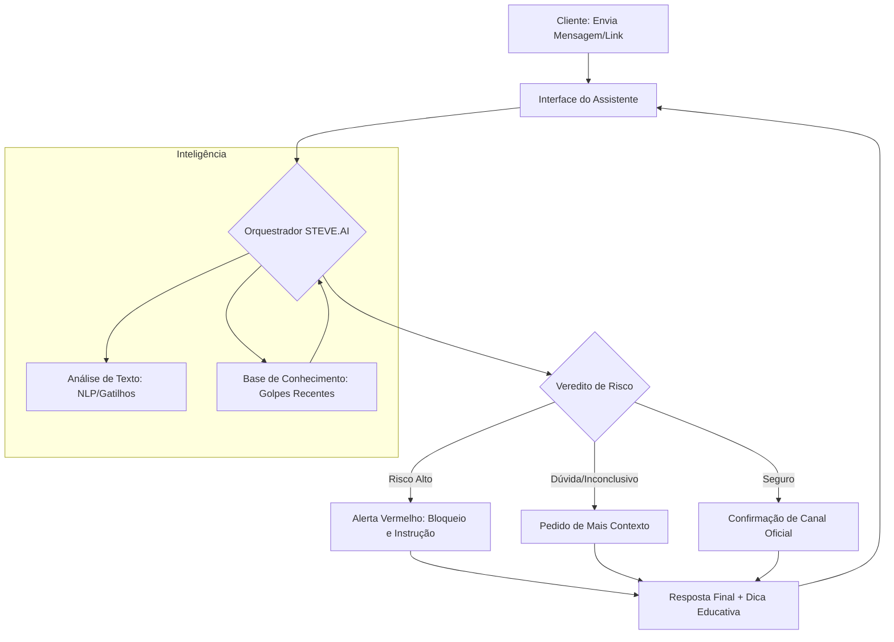

# Documentação do Agente

## Caso de Uso

### Problema
> Deteccao de golpes e fraudes

O projeto aborda a crescente vulnerabilidade de clientes bancários a golpes de engenharia social.

### Solução
> A solução utiliza Inteligência Artificial Generativa para decompor mensagens suspeitas através de uma triagem técnica e comportamental. Em vez de uma simples lista de termos bloqueados, o agente realiza uma "autópsia" do texto baseada em quatro pilares

1. Identificação de Gatilhos de Urgência e Medo (Engenharia Social)

2. Perícia em Links e Domínios

3. Análise Sintática e de Tom (NLP)

4. Relatório Educativo (O "Porquê")
Ao final da análise, o agente não apenas emite um veredito de "Risco", mas educa o usuário com uma explicação lógica:

### Público-Alvo
> O projeto foca em clientes do sistema bancário que utilizam canais digitais, dividindo-os em três perfis principais de vulnerabilidade

1. Inclusos Digitais Recentes e Idosos (Público Prioritário)
Este é o grupo mais visado por criminosos devido à menor familiaridade com as sutilezas das interfaces digitais.

2. Jovens Adultos e Usuários Hiperconectados
Embora dominem a tecnologia, este público cai em golpes pela velocidade e volume de informações.

3. Pequenos Empreendedores e MEIs
O público PJ (Pessoa Jurídica) é alvo de golpes específicos de cobrança e atualização de dados cadastrais.

---

## Persona e Tom de Voz

### Nome do Agente
STEVE.AI (Especialista em Segurança e Confiança para Avaliação Virtual)

### Personalidade
> O STEVE.AI comporta-se de forma Analítica, Protetora e Educativa

O STEVE.AI é o seu vigilante digital: rápido para alertar sobre perigos, mas sempre calmo e didático para explicar como se proteger.

### Tom de Comunicação
> O tom de comunicação do STEVE.AI é Acessível, Vigilante e Transparente.

Uma comunicação clara, fácil de entender e que transmite a autoridade de quem entende de segurança sem ser arrogante.

### Exemplos de Linguagem

Saudação (Foco em Segurança):

"Olá! Eu sou o STEVE.AI, seu assistente de segurança digital. Recebeu alguma mensagem estranha ou está na dúvida sobre uma ligação? Cole o texto aqui ou me conte o que aconteceu para eu te ajudar."

Confirmação (Iniciando Análise):

"Entendi o seu receio. Vou analisar os detalhes dessa mensagem agora mesmo para verificar se existem sinais de fraude. Só um momento."

Alerta de Risco (Golpe Detectado):

"⚠️ Atenção! Isso tem todas as características de um golpe. O link enviado não é oficial e o tom de urgência é uma tática comum para te enganar. Não clique e não forneça dados."

Validação Positiva (Mensagem Segura):

"Fique tranquilo(a)! Verifiquei que este é um canal oficial de comunicação do Bradesco. Você pode seguir com o atendimento com segurança."

Erro/Limitação:

"Ainda não consigo analisar esse tipo de arquivo, mas se você puder colar o texto da mensagem ou descrever a situação, consigo te dar um diagnóstico de segurança agora."

Encerramento Educativo:

"Fico feliz em ajudar! Lembre-se: o Banco nunca pede sua senha ou tokens por telefone ou SMS. Posso te ajudar com mais alguma dúvida de segurança?"

---

## Arquitetura

### Diagrama

### Componentes

| Componente | Descrição |
|------------|-----------|
| Interface | Chatbot em Streamlit |
| LLM | Ollma |
| Base de Conhecimento | arquivos JSON/CSV contendo a lista de domínios oficiais do Bradesco e os "Modus Operandi" dos golpes mais recentes. |
| Orquestracao (RAG) | Uso de LangChain para gerenciar o fluxo de dados entre o usuário, a base de conhecimento de golpes e o modelo de linguagem (LLM). |
| Validação | Checagem de alucinações |
| Seguranca | Filtros de Conteúdo (Impede que a IA saia do assunto ou aceite comandos maliciosos) |

---

## Segurança e Anti-Alucinação

### Estratégias Adotadas

- [ ] Agente só responde com base nos dados fornecidos
- [ ] Respostas incluem fonte da informação
- [ ] Quando não sabe, admite e redireciona
- [ ] Bloqueio de Dados Sensíveis: O agente detecta e avisa o usuário para não digitar senhas ou tokens durante a conversa, deletando qualquer dado sensível identificado
- [ ] Checagem de URLs (Hard Validation): O agente cruza obrigatoriamente qualquer link enviado com a lista de domínios permitidos pelo banco antes de emitir um veredito.

### Limitações Declaradas
> O que o agente NÃO faz?

Não realiza transações: O STEVE.AI é um assistente informativo e não tem poder para realizar transferências, pagamentos ou estornos diretamente na conta do cliente.

Não acessa dados em tempo real da conta: O agente não consegue ver o seu saldo, extrato ou histórico de transações reais para confirmar se um PIX foi recebido ou enviado.

Não substitui canais oficiais de bloqueio: Em caso de roubo comprovado, o agente orienta o usuário, mas não substitui a necessidade de ligar para o SAC ou utilizar as funções de bloqueio dentro do App oficial.

Análise baseada em probabilidade: Embora altamente preciso, o agente trabalha com padrões de linguagem. Ele não pode garantir 100% de segurança em golpes inéditos que ainda não constam na sua base de conhecimento atualizada.

Não solicita dados sensíveis: O agente nunca solicitará senhas, CVV de cartões ou tokens de acesso. Caso o usuário insira essas informações, o agente não terá capacidade de "salvar" ou "processar" esses dados para fins de serviço.
